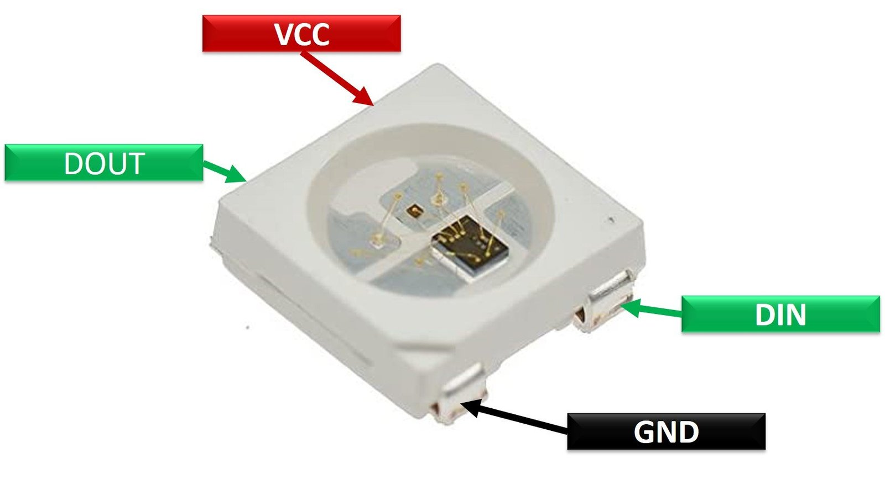
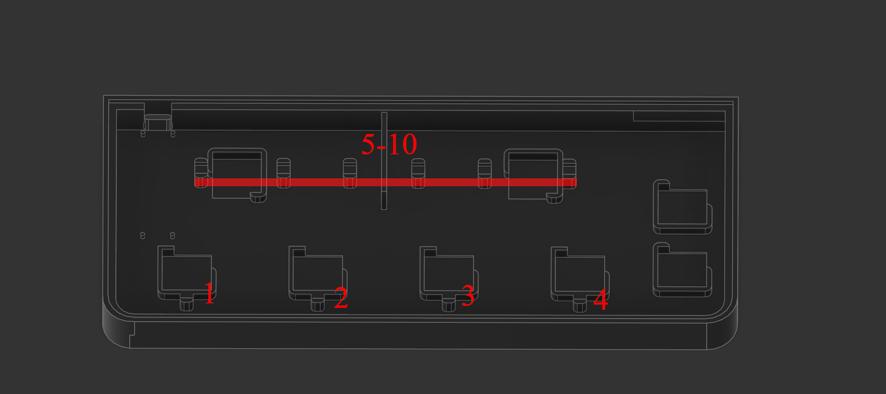

# Project Diva Controller

## Main features:
- Cheap
- Simple
- Compact (fits 250x250 Printbeds)
- 4 Main buttons
- Fake Slidepad using buttons
- Enter/Escape Keys

## What you need:
- 1: Raspbery Pi Pico
- 8: Kailh Choc switches
- 10: WS2812B 5050SMD LEDs
- 3D Printer
- Soldering Iron
- Wires
- Protoboard/Perfboard for easier wiring (Optional but highly reccomended)

# How to build:
Choose between the pressfit and the M3 Threaded version and print all parts.
The buttons don't require any post processing when printed with 0.1mm layers they are smooth enough as is.
Print the buttons wiht low infill so that they stay lightweight and more transparent. I choose to give them all different infill patterns similar to their symbol.

## Wiring
### Buttons
I choose the following GPIO Pins

Triangle/W GP16

Square/A GP17

Cross/S: GP18 

Circle/D: GP19 

Enter: GP20 

Escape: GP21 

SlideLeft/Q: GP4 

SlideRight/E: GP5

However can wire these any way you want, you can alter the assigned GPIO Pins starting from line 23 in the code.

### LEDs
The first 4 LEDs are Triangle, Square, Cross and Circle in that order and light up along with button presses,

the last 6 LEDs can be placed in any order beneath the slidebar.

The DataIn of the first LED has to be connected with GP0 after that they are wired in series.
Here's a wiring Diagram.

